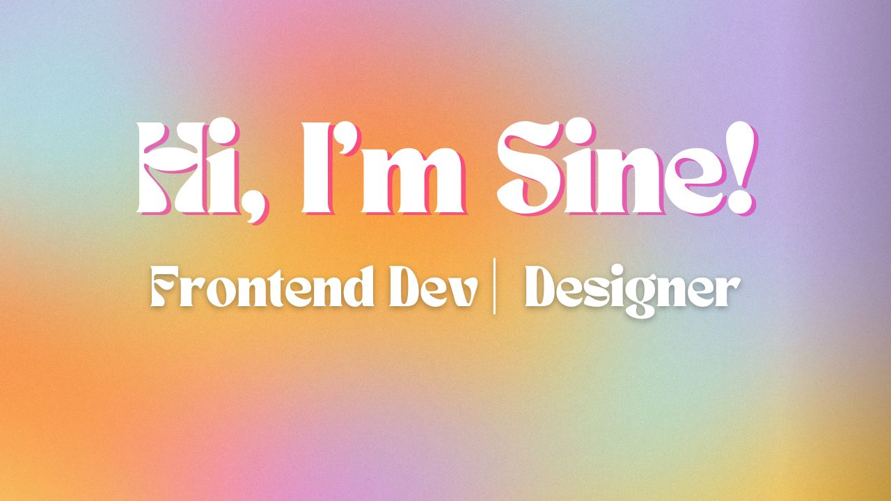

<!--  https://ritik307.github.io/portfolio/  -->

 

  I’m a designer learning to be a frontend developer. 🎨  
 Passionate about creating websites that are as beautiful to look at as they are to use. 💻

  

<h2 align="center">Technology Stack </h2>

 

<!--  -->

<h2 align="center">Reach me at </h2>

 
</a>

<h2 align="center">
  My Contribution Graph 
</h2>

  

<h2 align="center">
  My Github Stats
</h2>
 
 

  
  

 

 

 

 

⭐

↓ Check out my top projects below ↓ 

